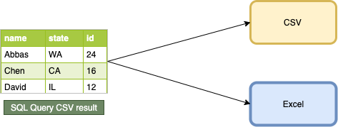
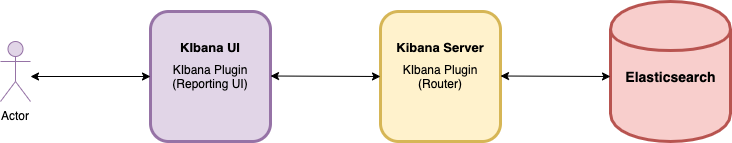
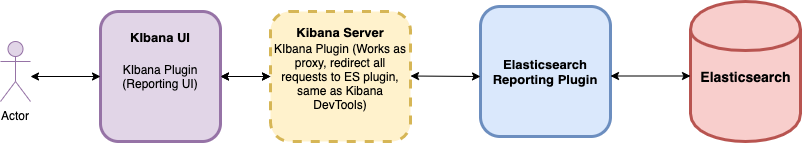
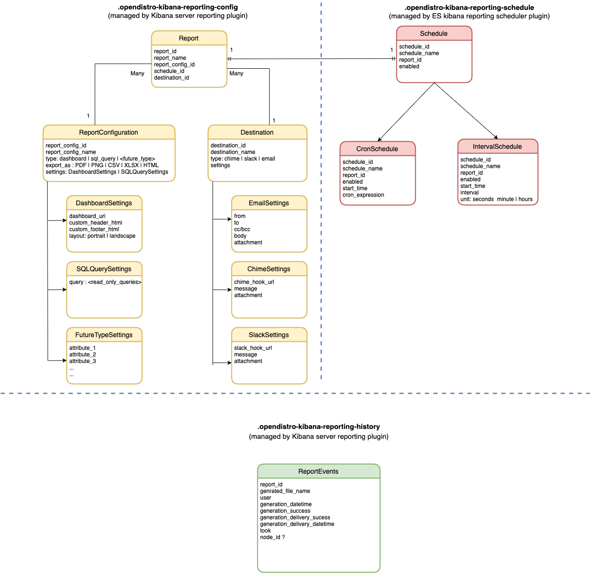

# Kibana Reporting
### You don’t have to go a dashboard, we will bring dashboards to you.

---

## 1. Overview

### 1.1 Motivation

The ability to generate reports from dashboards and views on Kibana is a highly requested feature .
This plugin will introduce the ability to generate reports, as well as enable the user to customize them, receive them on a schedule or monitor, and have the reports received on external channels such as email, Slack and Chime. 

- https://discuss.opendistrocommunity.dev/t/reporting-module/153
- https://github.com/opendistro-for-elasticsearch/community/issues/16

### 1.2 Introduction

Kibana Reports for Open Distro allows ‘Report Owner’ (engineers, including but not limited to developers, DevOps, IT Engineer, and IT admin) export and share reports from Kibana dashboards, saved search, alerts and visualizations. It helps automate the process of scheduling reports on an on-demand or a periodical basis (on cron schedules as well). Further, it also automates the process of exporting and sharing reports triggered for various alerts. The feature is present in the Dashboard, Discover, and Visualization tabs. Scheduled reports can be sent to (shared with) self or various stakeholders within the organization such as, including but not limited to, executives, managers, engineers (developers, DevOps, IT Engineer) in the form of pdf, hyperlinks, csv, excel via various channels such as email, slack, Amazon Chime. However, in order to export, schedule and share reports, report owners should have the necessary permissions as defined under Roles and Privileges.


## 2. Requirements


1. As a user, I want to see a 'Share >' 'As a report' on the share menu, and a 'Download > ' 'PDF, CSV, PNG' contextually button in the  Dashboard, Visualizations, and Discover Tabs.
1. As a user, I should be able to export and share reports only if I have the permissions to do so. Else, an error should be thrown.
1. As a user, when I click ‘Share > As a report’ I should be able to configure, save, export and share the report.
1. As a user, when I click ‘Share > As a report’, the system should allow me to share the dashboard or saved search or visualizations that I am currently working on as a report.

    Here is the matrix showing various panels and what kind of export option should be available.        
    Kibana panel | PDF           | PNG           |Hyperlink (HTML) | CSV/Excel
    ------------ | ------------- | ------------- | ------------- | -------------
    Dashboards | Yes | Yes | Yes | No
    Visualizations | Yes |  Yes |Yes | No
    Discover (saved search) | No | No | Yes | Yes

### In-context reports
1. As a user, I can download a PDF, PNG, CSV, XLS file in-context from any available panel (e.g. Dashboards, visualizations, saved searches, etc).
1. As a user, any time I download a report from any available panel (e.g. Dashboards, visualizations, saved searches, etc), a report will be auto-generated in the reports list.
1. As a user, I can create a report definition from the share menu of any available panel (e.g. Dashboards, visualizations, saved searches, etc).

### Reporting Landing Page
#### Reports
1. As a user, I should see Name, Type, Sender, Recepient(s), Source, Last updated, State, Download on the `Reports` list.
1. As a user, I should be able to filter my reports list by sender, receiver, status, and type.
1. As a user, I should be able to search my reports by report name.
1. As a user, I should be able to view a report details page for any report on the list.
1. As a user, I should see my reports ordered in reverse chronological order by default.
1. As a user, I should be able to download the default file format from the reports list.
1. As a user, I should be able to see a list of reports for the past 100 days.
1. As a user, archived reports should not be visible by default (the default filter should exclude archived reports) (p2)


#### Report definitions
1. As a user, I should see Name, Type, Owner, Source, Last updated, Details, Status (active/disabled) on the `Report definitions` list.
1. As a user, I should be able to view, edit and delete a report definition.
1. As a user, I should be able to enable/disable a report definition
1. As a user, I should be able to export and import one or more report definitions (as xml or some other format) via APIs

### Create, View, Edit
#### Create report definition
##### Report settings
1. As a user, I should be able to set the report name.
1. As a user, I should be able to set an optional report descritption.
1. As a user, I should be able to select a report source type (Dashboard, Visualization, Saved Search)
1. As a user, I should be able to select a specific source (Dashboard, Visualization, or Saved search, contextually).
1. As a user, I should be able to select the default file format for my report, contextual to my selected source (PDF, PNG, CSV, Excel, etc)
1. As a user, I should be able to add a `Header` and `Footer` to PDF and PNG reports.
    1. As a user, I should see Report title and a sample paragraph in the `header` by Default.
    1. As a user, I should see date, time and report name in the `footer` by Default.
1. As a user, I should be able to select which charts/visualizations I can include in a PDF or PNG report. (p2)

##### Report trigger
1. As a user, I should be able to select a report trigger type that belongs to one of two categories: `Schedule`, and `Alert`.
1. As a user, when I select `Schedule`, I should be able to select a request time of now, future date, recurring, or custom cron expression (similar to alerting).
    1. As a user, if I select `now`, I should be able to generate a report immediately after saving the report definition.
    1. As a user, if I select `future date`, I should be able to configure the date and time the report will be generated.
    1. As a user, if I select `recurring`, I should be able to configure a recurring schedule.
    1. As a user, if I select `custom cron`, I should be able to configure a cron-based schedule.
    1. As a user, if I select `recurring` or `custom cron`, I should be able to configure an end date.
1. As a user, when I select `Alert`, I should be able to select the alert a report gets triggered from.

##### Delivery settings
1. As a user, I should be able to deliver a report to Kibana and/or Email recepients.
1. As a user, when I set Kibana as a delivery channel, I should be able to select which Kibana users the report gets delivered to.
1. As a user, when I set email as a delivery channel, I should be able to set recepients, email subject, and email body.
1. As a user, I should be able to insert a file URL refecence to the email body.
1. As a user, I should be able to insert the report source URL reference to the email body.
1. As a user, I should be able to attach the report file to an email.
1. As a user, I should be able to set the file format of report attachment (pdf, png | csv, excel, depending on the source).

#### Report creation
1. As a user, when I create a report definition, the definition settings are saved and show up as a list item in the ‘Report definitions’ list.
1. As a user, when a report definition has been triggered via schedule or alert, I should be able to see an instance of the report in my "Reports" list, and any users I send the report to, will also see a report instance in their repective "Reports" list page.
1. As a user, when a report is created from a triggered definition condition, I should receive a notification on all configured delivery channels (Email, chime, slack, etc)
1. As a user, when a new report is available I should see a notification status in the reporting icon in the sidebar
1. As a user, when a report fails due to an error, I should see the report with a failed status on the `Reports` list.
1. As a report definition owner, when a report fails to trigger due to an error, I should receive a kibana toast alert letting me know that the report failed.

#### View report definition details
1. As a user, I should be able to view all my saved definition settings.
1. As a user, I should be able to edit, duplicate or delete a report definition.
    1. As a user, when I delete a report definition, any schedule or alert based triggers will automatically stop.

#### Edit report definition
1. As a user, I should be able to edit the report settings, triggers and delivery settings.
1. As a user, I should be able to save my updated report definition.

#### View report details
1. As a user, I should be able to see both created date, and last updated date.
1. As a user, I should be able to share an existing report.
1. As a user, I should be able to archive an existing report. (p2)
1. As a user, I should be able to downlaod available report files (PDF, PNG, CSV, Excel, etc)
1. As a user, I should be able to copy the permalink to a report source.
1. As a user, I should be able to view the report shared with me via email as an embedded HTML.

##### Sharing or archiving an existing report
1. As a report owner, I should be able to share or archive a report.
    1. As report owner, I should be able to add new email recepients, and new kibana recepients to an existing report.
    1. As a report owner, I sholud not be able to remove existing email or kibana recepients from an existing report.
    1. As a report owner, I should receive a Kibana toast notification when a report has been delivered to new recepients.
    1. As a report recepient, I should not get new notifications or emails when additional users have been added to an existing report.
1. As a report recepient, I can only archive a report.


### Functional
* The user should be able to create/modify reports both through the Kibana UI or programmatically through APIs.
* Ability to schedule/trigger reports periodically (a cron based schedule) or at a given frequency continuously or within certain time range.
* Ability on instantly create downloadable reports or deliver scheduled reports via external channels.
* Ability to enable/disable report generation
* Ability to generate download logs as part of fine-grained audit logs.

### Non-functional

* In the absence of missing subsystems such as a Elasticsearch report scheduler plugin, the scheduling UI should be hidden or present the user with correct messaging (for example limited functionality)
* The service should be reliable -  we should be able to generate a report in an acceptable time frame or else abort.
* **Security** - a user should not be allowed to create reports of resources they don’t have access to. For example, if a user should not be able to generate report of dashboard with index-pattern they do not have read permissions to.


## 3. Design

From implementation point of view need to answer/solve four problems:

### 3.1 What: (Report Configuration)

We will provide user to generate two kind of reports :

1. Based on Kibana dashboards **TODO**: Investigate how dashboards are defined
2. Based on queries 
    1. SQL queries
    2. Elasticsearch DSL (Out of Scope) - Though this will be a great feature to have, we will have to scope down what kind of Elasticsearch queries can be supported (depending on whether how easily it can be CSV formatted) and re-implement the CSV formatting logic from Elasticsearch JSON response.


*Figure -1*



*Figure -2*

### 3.2 When: (Schedule or Trigger)

We should expose the APIs to generate reports on-demand (instantly) and to schedule periodically (cron like) or continuously with fixed intervals.  Any external or integrated scheduler/trigger will be a consumer of instant report generation API with a mandatory report delivery channel.


### 3.3 Where: (Notification)

Storing the reports  **TODO: why we don’t want to store reports, kibana detached mode, ; kibana locally on each node**

1. For instant on-demand reports, if requested through browser or any HTTP client the reports
2. For reports triggered by non-browser clients (ODFE Report scheduler plugin , ODFE plugin), it will be mandatory to provide delivery channels such as email, Chime or Slack endpoints. 


*Figure - 3*

### 3.4 How:

**(I)** We want to reduce time to market and avoid reinventing the wheel. To create PDF/PNG based reports for dashboard we will be relying on open source headless browser libraries.

List of curated headless browsers https://github.com/dhamaniasad/HeadlessBrowsers

|Binding	|Library	|Comments/Info	|
|---	|---	|---	|
|NodeJS	|[Puppeteer](https://developers.google.com/web/tools/puppeteer)	|[Github](https://github.com/puppeteer/puppeteer), [NPM](https://www.npmjs.com/package/puppeteer)	|
|	|[Horseman](https://www.npmjs.com/package/node-horseman)	|	|
|	|	|	|
|Java	|[Selenium](https://www.selenium.dev/)	|No support for PDF generation	|
|	|[jBrowserDriver](https://github.com/MachinePublishers/jBrowserDriver)	|No support for PDF generation	|

**(II)** To generate CSV reports based on SQL queries, we will be leveraging OpenDistro SQL plugin with **`format=csv`**

```
POST _opendistro/_sql?format=csv
{
    "query" : "SELECT ... FROM ... WHERE ... ORDER BY ..."
}
```


Based on the above technical requirements, we propose the following architectures.

### 3.5 Architecture Considerations

### 3.5.1 Architecture - 1 

In this architecture , the Kibana backend plugin will handle both the report generation logic as well as scheduling mechanism.




**Pros:**

* Easy to manage in terms of release and distribution since all the report generation, notification and scheduling are embedded in a single application.

**Cons:**

* Kibana is not distributed by nature. In the absence of leader election capabilities where multiple Kibana instances are running with reporting plugin, the same report will be generated per instance of Kibana.
* Effort to create integration scheduling module.

### 3.5.2  Architecture - 2

In this architecture , the Kibana backend plugin will handle only the report generation logic and the scheduling functionality will be delegated to a separate Elasticsearch plugin


**Pros:**

* No need to reinvent the integrated scheduling mechanism, since we can leverage ODFE Job scheduler plugin.
* Extending job scheduler plugin will allow us to make sure that only one instance of Kibana handles report generation and thus eliminate coordination among Kibana instances.

**Cons:**

* This will introduce hard dependency on report scheduler plugin.
* Multiple indices to manage.

### 3.5.3  Architecture - 3

In this architecture , the whole report generation and scheduling functionality will implemented as Elasticsearch plugin. Kibana backend will act as a proxy between Kibana UI and ES plugin.



**Pros:**


* Since Kibana server plugin will act as proxy, the Kibana APIs will have chances of modification and in the future
* Reduced interprocess communication between Kibana server and Elasticsearch, thus reduced latency and minimal coordination errors.

**Cons:**

* Lack of  Java based headless browser that can generate PDF’s. 


### **3.5.4 Decision:**

Because of the limited distributed nature of Kibana sever and added effort to develop a stable scheduling mechanism as part of Kibana server plugin, we need  to eliminate option ***3.5.1. ***Though ***3.5.3*** would be an idle choice to go with, lack of core functionality (to generate PDFs) as Java/Kotlin binding prohibits to go with that approach. ***3.5.2 ***allows to reuse existing libraries and plugin extensions, and would be the choice of implementation.


## 4. Detail Design

### 4.1 Data Model

TODO: write-up



TODO: Add index mappings . 

### 4.2 Kibana Server APIs

All the Kibana Server APIs will be exposed as HTTP(S) RESTFul APIs.

API calls are stateless. Each request that you make happens in isolation from other calls and must include all of the necessary information for Kibana to fulfill the request. APIs may optionally take JSON formatted request body.
API requests return JSON output, which is a format that is machine-readable and works well for automation.

List of existing [Kibana REST APIs](https://www.elastic.co/guide/en/kibana/master/using-api.html)

**(A) generateReport**

To create one-time reports

```
# used to create one-time instant report from browser which will be downloaded 
#in the browser (user might be prompted for download location)
generateReport(report_config)


```

To create one time reports will external delivery channel

```
# used to create one-time instant report delivered to a destination
# useful to non-browser usecases, for example ad hoc command line report creation 
# via curl or scripts 
generateReport(report_config, destination)
```

Used by external triggers such as Reporting Scheduler Plugin and Alerting plugin, with delivery predefined as part of report definition

```
# this will be used by job scheduler
generateReport(report_id)

```

**(B) createReport**

Create a schedule report with destination

```
# to create schedule reports - report configuration , schedule and destination 
# are all mandatory
createReport(report_config, schedule, destination)

```


**(C) listReports**

```
# list report details for a specific report
listReports(report_id)

```

```
# list all reports
listReports()

```


**(D) updateReport**

Update different attributes of the report like report configuration and/or schedule and/or destination

```
# updates report config , for example changes in custom header , footer, layout, 
# format (pdf -> png) etc 
updateReport(report_config)

```

```
# updates schedule frequency or disable temporarily
updateReport(schedule)

```

```
# update deleivery methods for example from chimr to email
updateReport(destination)

```

```
# update report configuartion and/or schedule and/or destination or 
# a combination thereof
updateReport(report_config x schedule x destination)

```


**(E) deleteReport**

```
# delete report definition by report_id, this will delete report definition 
# and associated schedule, but will leave report config and destination intact
deleteReport(report_id)

```


**(F) createDestination**

```
# create a new destination
createDestination()
```


**(G) listDestination**

```
# useful API for use in Kibana UI to help resuse destinations (via dropdown)
listDestination()
```


**(H) updateDestination**

```
# modify an existing destination
updateDestination(destination_id, updated paramter values)
```


**(I) deleteDestination**

```
# delete an existing destination by destination_id
deleteDestination(destination_id)
```


**(F) listReportEvents**

List all the instances of report generation/failure for audit/testing/security inspection

```
listReportEvents()

# filtered API
listReportEvents()
```

### 4.3 Job Scheduler APIs

https://github.com/opendistro-for-elasticsearch/job-scheduler

**(A) createSchedule**

**(B) updateSchedule**

**(C) deleteSchedule**

### 4.4 Workflows

Scheduled Report Creation workflow


### 4.4 Alerting Integration

https://opendistro.github.io/for-elasticsearch-docs/docs/alerting/

ODFE Alerting can be used as an external trigger. To generate the report the `generateReport()` API can be utilized as `custom_webhook` destination.

```
POST _opendistro/_alerting/destinations

{
  "type": "custom_webhook",
  "name": "my-custom-destination",
  "custom_webhook": {
    "path": "/api/kibana/generateReport/<report-id>", <-----
    "header_params": {
      "Content-Type": "application/json"
    },
    "scheme": "HTTPS",
    "port": <kibana-port>,
    "query_params": {
      "token": "R2x1UlN4ZHF8MXxxVFJpelJNVDgzdGNwXXXXXXXXX"
    },
    "host": <kibana-host>
  }
}

```


### 4.5 Security Considerations

TODO


* * *

## Appendix

### (I) Resources for API Design principles/best practices

* https://www.toptal.com/api-developers/5-golden-rules-for-designing-a-great-web-api
* https://docs.microsoft.com/en-us/azure/architecture/best-practices/api-design
* [Designing RESTFul APIs - Lynda.com](https://www.lynda.com/Web-Development-tutorials/Designing-RESTful-APIs/642497-2.html?srchtrk=index%3a38%0alinktypeid%3a2%0aq%3arestful%0apage%3a1%0as%3arelevance%0asa%3atrue%0aproducttypeid%3a2) (Access for free with free KCLS membership https://kcls.org/library-cards/)
* OpenAPI - https://swagger.io/

### (II) Security reference

* https://opendistro.github.io/for-elasticsearch-docs/docs/security-configuration/concepts/
* https://opendistro.github.io/for-elasticsearch-docs/docs/security-access-control/
* https://opendistro.github.io/for-elasticsearch-docs/docs/security-access-control/api/

