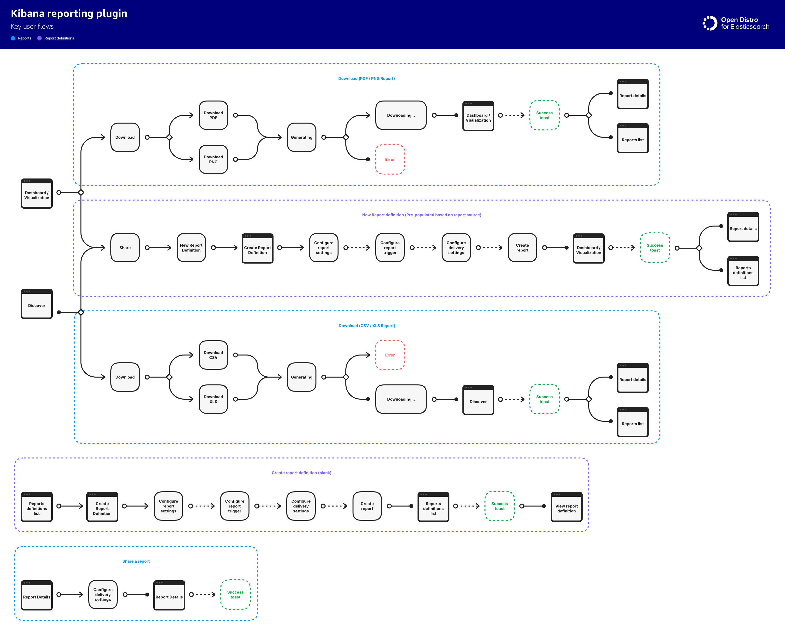
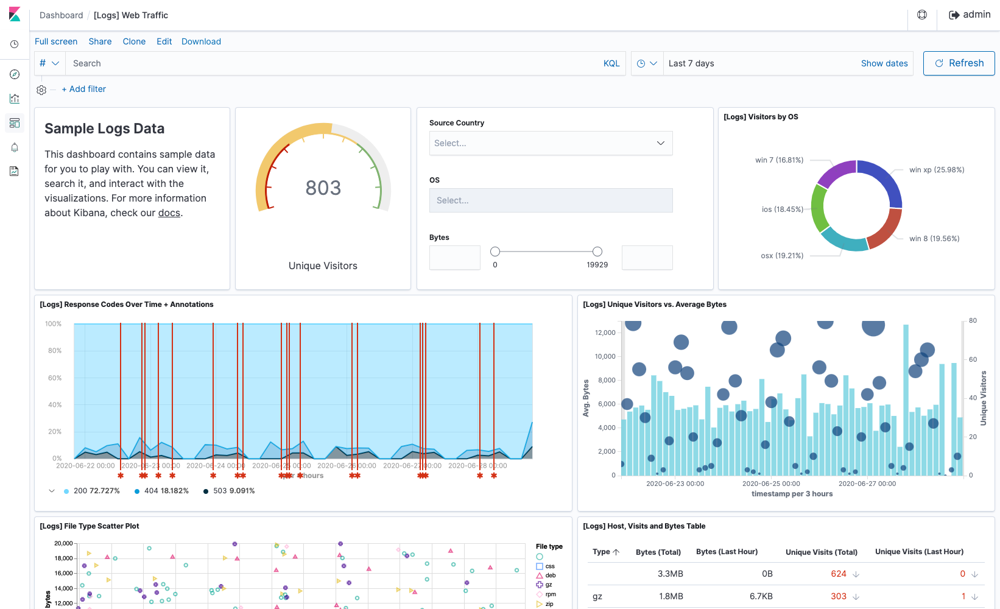
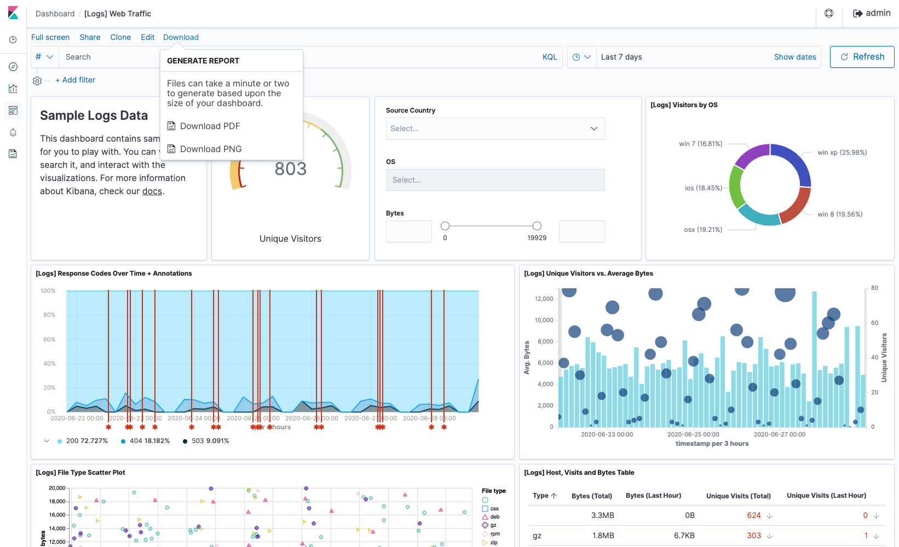
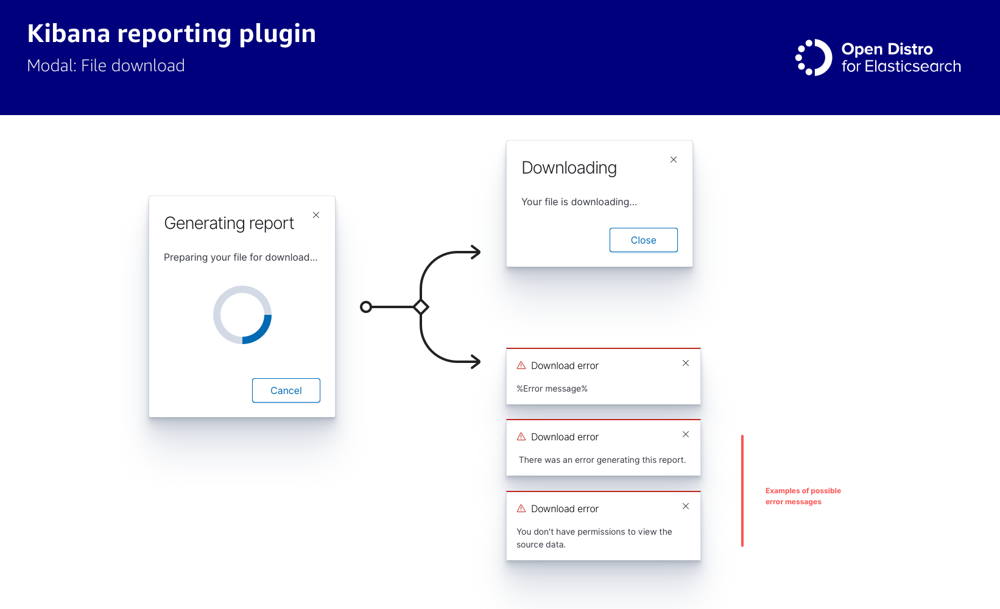

# Kibana Reporting
## Overview
Kibana Reports for Open Distro allows `report owners` (including but not limited to Developers, DevOps, IT Engineers, and IT admins) to export and share reports from Kibana dashboards, saved queries, alerts and visualizations. It helps automate the process of scheduling reports via on-demand or periodic basis (including cron schedules). It also automates exporting and sharing reports from triggers, such as alerts. The feature is present in the Dashboard, Discover, and Visualization tabs. Scheduled reports can be sent to (shared with) self or various stakeholders within the organization such as, including but not limited to, executives, managers, engineers (developers, DevOps, IT Engineer) in the form of pdf, hyperlinks, csv, excel via various channels such as email or the Kibana reporting plugin.

## Key user flows
### From source
These cover downloading a PDF or PNG report from a Dashboard or Visualization, downloading a CSV or Excel report from Discover, as well as creating a new Report Definition from the Dashboard, Visualization, or Discover tabs.

### From report definitions list
This flow covers creating a new report definition from the `Report definitions` list.

---

### Share a report
This flow covers sharing a report from the `report details` page.

---

## Key screens
These cover the key connections between Reports, Report details, Report definitions, Report definition details, the Dashboard, Visualization and Discover tabs, as well as Emails.

---

## Mockups
### Dashboard
This is representative of the `Dashboard`, `Visualization` and `Discover` tabs. There is a new `Download` context menu that has been added to this view.

---

From the share menu, you can create a new report definition.

---

The download menu allows users to generate a report (PDF, PNG, CSV, XLS, depending on the source type)

---

Triggering a download will start the generation / download process.

---

After successfully creating or downloading a report, you are returned to the context where you were working from, and a toast alert notifies you that your report, or report definition is ready. From the alert you can navigate to the report details, report definition, or the Reports landing page. In the case of a report download failure, this is where the failure notification is also delivered.

### Reporting plugin landing page

The reporting landing page displays a list of available reports, as well as a list of configured report definitions. From here you can create a new report, link directly to the report source, download the report file (which will trigger the same download flow as above, with the exception that a new report will not be generated), or view the report details.

---

An empty state view is also available when there are no reports or report definitions in the list.

---

### Report details

Here you can view the details of a report that's been generated. From the report details, you can download the report file, share a report, archive a report, and visit the report source or copy it's permalink.

---

### Report details - sharing a report

Sharing a report allows you to add kibana recepients, optionally add new email recepients, as well as configure the email subject, body and optionally include the report as an attachment to the email.

---

### Report definition

Here you can view the details of a report definition. From the report definition page, you can edit your report definition, and enable or disable it (so it's not triggered by the set schedule or alert). You can also visit or copy the report source URL.

---

### Create Report definition

Creating a report definition allows you to define how a report will be triggered or configured. Here you can generate a one-time report to be delivered immediately (Similar to sharing a report from a dashboard), or at a later date, as well as set recurring and cron-based schedules, or select an alert that will trigger the report generation. You can also configure delivery to yourself and other Kibana users, email recepients, and optionally include the report as part of the email attachment.

---

#### Supporting view: Report settings

---

#### Supporting view: Report trigger

---

#### Supporting view: Delivery settings

